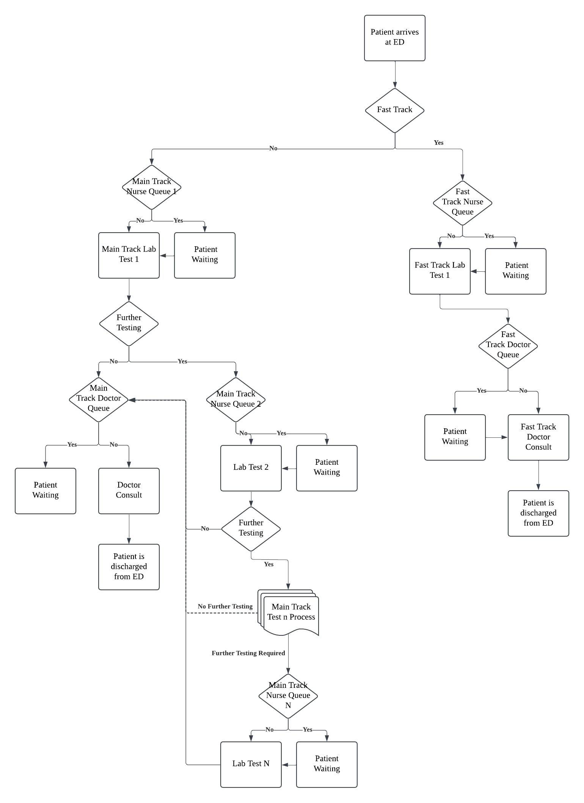

# Emergency Department Simulation

This repository contains a simulation model for an **Emergency Department**. The model tracks patients, medical resources, and service processes to analyze key performance metrics such as queue lengths, staff utilization, and patient wait times.

## 📌 Components

### **System**
- **Emergency Department**

### **Entities**
- **Patients**

### **Resources**
- **Nurses**
- **Doctors**
- **Beds**

### **Attributes**
- **Type of Patient**
- **Type of Service**
- **Service Time**

### **Activities**
- **Lab Test (by Nurse)**
- **Doctor Consult**
- **Stay in Bed**

### **Events**
- **Arrival**
- **Departure**

### **State Variables**
- **Queue length at each station**
- **Number of staff busy at each station**

## 📌 Process Flow Chart


## 📌 Input Data

### **Definitions**
#### **Stations**
- **Lab (Staffed by nurses)**
  - Nurses allocated to a lab remain within that lab and do not move to other labs even if free.
  - Labs are processed sequentially in ascending order.
- **Doctor’s Room** (Doctor consultations)
- **Bed** (Only for main track patients requiring a stay after a doctor consultation)

### **Inputs**
#### **Station Parameters**
- Number of staff/beds
- Name
- Treatment time distribution
- Probability station is needed
  - The first lab and doctor's room are compulsory for all patients, overriding any specified probability to **1**.

#### **Patient Parameters**
- Probability of patient being in **Fast Track**
- Patient interarrival time distribution

## 📌 Output Collected
- **Average Queue Length at Each Station**
- **Average Number of Staff Busy at Each Station**
- **Average Patient Wait Times at Each Station** *(Not implemented due to time constraints)*

## 📌 Methodology

1. **Check for initialization bias** and determine the burn-in period.
2. **Repeat simulation** for `n` iterations to compute averages and confidence intervals:
   - Batch size per iteration is hardcoded as **burn-in period × 4**.
   - Check if values across simulations for each station fall within an **absolute tolerance of 0.5** with **95% confidence**.

## 📌 Instructions for Running the Code

1. **Install required dependencies** using:
   ```sh
   pip install -r requirements.txt
   ```
2. **Launch the Streamlit interface**:
   ```sh
   streamlit run app.py
   ```
3. **Modify simulation settings** in the **Settings Page**.
4. **Check for initialization bias** by clicking the **"Check Initialisation Bias"** button. Determine the burn-in period from the graph.
5. **Set the burn-in period** in settings and click **"Get Simulation Results"** to run the analysis.

---

### 📌 Future Work
- Implement **Average Patient Wait Times** computation.
- Improve visualization of results within the Streamlit app.